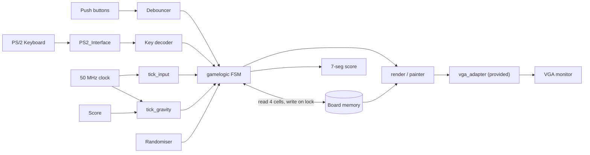

# FPGA Tetris

> Tetris implemented in pure Verilog for an Altera DE-series FPGA. PS/2 keyboard, 640x480 VGA output, and a state machine that runs the whole game on a 50 MHz clock.

[](https://en.wikipedia.org/wiki/Verilog)
[](https://www.intel.com/content/www/us/en/products/programmable.html)
[](https://www.intel.com/content/www/us/en/software-kit/795188/intel-quartus-prime-lite-edition-design-software-version-21-1-for-windows.html)


## ✨ Features
- **Real hardware, not a simulator.** PS/2 keyboard input, VGA output, 7-segment score display, all running on a single 50 MHz clock domain with synchronous logic.
- **Five-state game FSM.** Idle, Spawn, Fall, Lock, Game Over. Collision checks read four occupied cells in parallel from a multi-port board memory.
- **Score-driven gravity.** Falling speed scales with score via a tick generator, so the game gets harder the longer you survive.
- **Seven pieces with four rotations.** Standard tetromino set (I, O, T, S, Z, L, J), all 28 orientations stored as offset tables in `piece_offsets.v`.
- **Debounced inputs.** PS/2 scan codes are decoded into one-cycle pulses; KEY inputs run through a debouncer module so a single press maps to one move.

## 🏗 Architecture



The `gamelogic` module is the core FSM. It reads four cells per cycle from board memory (one for each block of the active tetromino), checks collision against boundaries, and writes the piece into board memory only on the Lock transition. The painter reads the locked board plus the active piece's offsets and rasterizes to the VGA framebuffer through the standard `vga_adapter`.

## 📁 Repo layout

```
src/
├── tetris.v               # Top-level wiring: PS/2, debouncer, FSM, painter, VGA, 7-seg
├── game/                  # Game logic
│   ├── gamelogic.v        # 5-state FSM: Idle, Spawn, Fall, Lock, Game Over
│   ├── board.v            # Block-RAM-backed game board with multi-port reads
│   ├── piece_offsets.v    # 7 tetrominoes × 4 rotations of (dx, dy) offsets
│   └── randomiser.v       # LFSR-style next-piece selector
├── io/                    # Inputs and on-board outputs
│   ├── PS2_Controller.v   # PS/2 protocol decode
│   ├── PS2_Input.v        # PS/2 scan-code-valid pulse generator
│   ├── SevSegDecoder.v    # 4-bit nibble to 7-segment hex display
│   └── input_debouncing/  # Synchronous debouncers for the on-board KEY inputs
└── vga/                   # Pixel pipeline
    ├── render.v           # Painter: rasterizes board + active piece to framebuffer
    ├── vga_background.v   # Static background drawing
    ├── vga_debug.v        # Debug overlay
    └── adapter/           # Standard UofT-provided VGA adapter package

testbench/
└── render_tb.v            # Painter testbench

assets/
├── bmp_640_9.mif          # Memory-init files used by the VGA pipeline
├── frame_640.bmp
├── framefinal.bmp
└── framefinal.mif
```

The `src/vga/adapter/` directory contains the standard UofT-provided VGA adapter package. Every other `.v` file in this repo is original.

## 🚀 Build and run

This targets an Intel/Altera DE-series board (tested pinout matches DE1-SoC, DE2, DE10 family). You'll need:

- Intel Quartus Prime (Lite is fine)
- An Altera DE-series board with PS/2 keyboard input and VGA output
- A VGA monitor and a PS/2 keyboard

Steps:

1. Create a new Quartus project, target your board's FPGA family (e.g. Cyclone V for DE1-SoC).
2. Add every `.v` file under `src/` (recursively) as a project source, plus every file under `assets/` and `src/vga/adapter/` as memory init data.
3. Set `tetris` as the top-level entity.
4. Pin-assign `CLOCK_50`, `KEY`, `SW`, `LEDR`, `HEX0`, `HEX1`, `PS2_CLK`, `PS2_DAT`, and the `VGA_*` signals to match your board's pin file.
5. Compile, program the FPGA, plug in a PS/2 keyboard, and connect VGA.

Controls: A = left, D = right, W = rotate. KEY[3] is the active-low reset.

## 📸 Demo

Photo or video of the board running the game: TBD.

## 👤 Author

**Antoine Tabet**, UofT Computer Engineering
[LinkedIn](https://linkedin.com/in/antoinetabetuoft) · [antoine.tabet@mail.utoronto.ca](mailto:antoine.tabet@mail.utoronto.ca) · [GitHub](https://github.com/tabetant)
